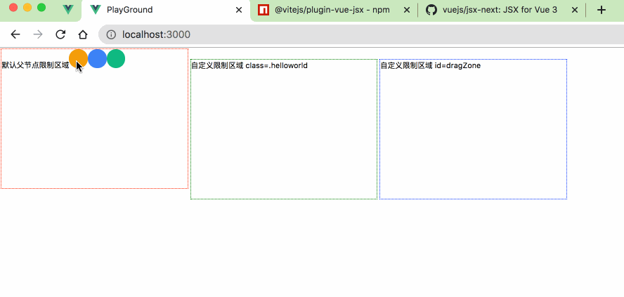

# A pure simple vue draggable directive

## preview



## npm install

```javascript
npm install vue-steven-draggable
```

## vue install

```javascript
import { createApp } from '@vue/runtime-dom';

import stevenDraggable from 'v-steven-draggable';
import App from './app';

const app = createApp(App);
app.use(stevenDraggable);

app.mount('#app');
```

## Used as a normal directive in jsx or template

```javascript
<div style='width:600px; height: 400px; border:1px solid gray;'>
  default DragZone
  {/* parent container will be used as default dragzone */}
  <span v-steven-draggable>DragZone = parent</span>

  {/* customized drazone .helloworld */}
  <span v-steven-draggable='.helloworld'>DragZone = .helloworld</span>
  
  {/* customized drazone #dragZone*/}
  <span v-steven-draggable='#dragZone'>DragZone = #dragZone</span>

  {/*demo dragzones*/}
  <div
    class='helloworld'
    style='display:inline-block; width:200px; height:150px; border:1px dotted green; margin: 2px'
  >
    customized drazone class=.helloworld
  </div>

  <div
    id='dragZone'
    style='display:inline-block; width:200px; height:150px; border:1px dotted blue; margin: 2px'
  >
    customized drazone id=dragZone
  </div>
</div>
```
